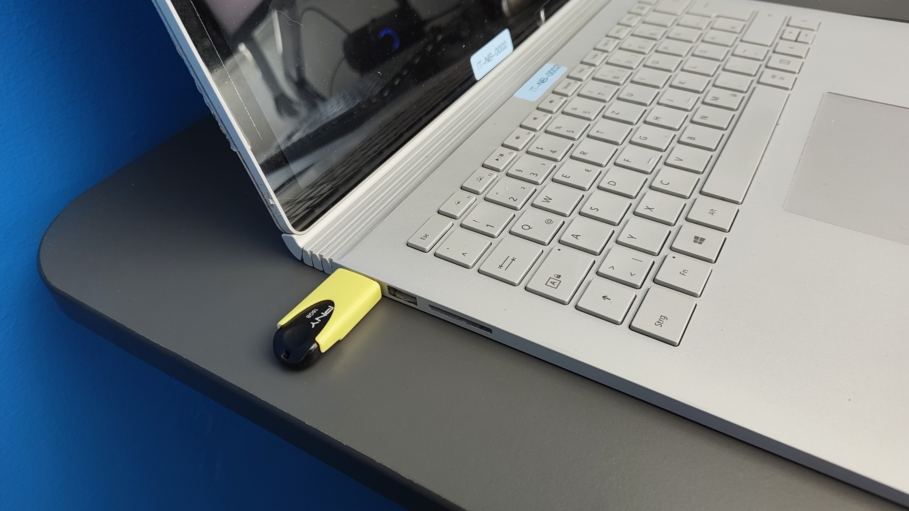
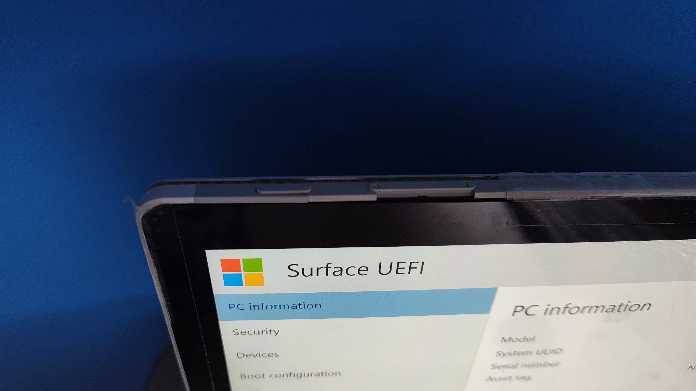
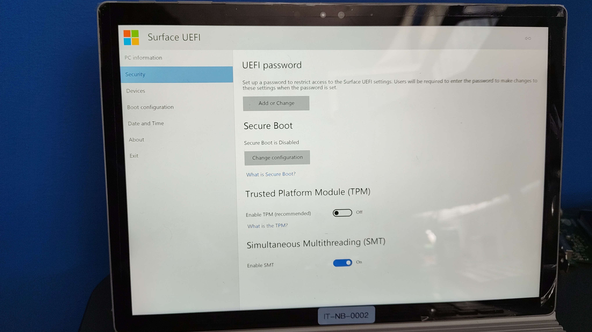
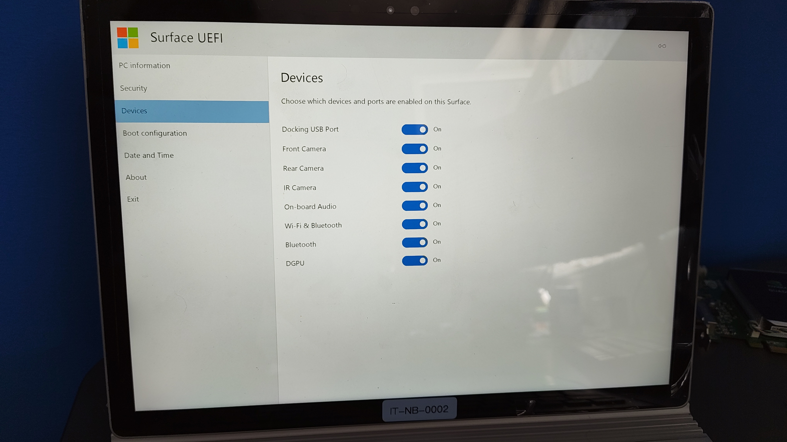
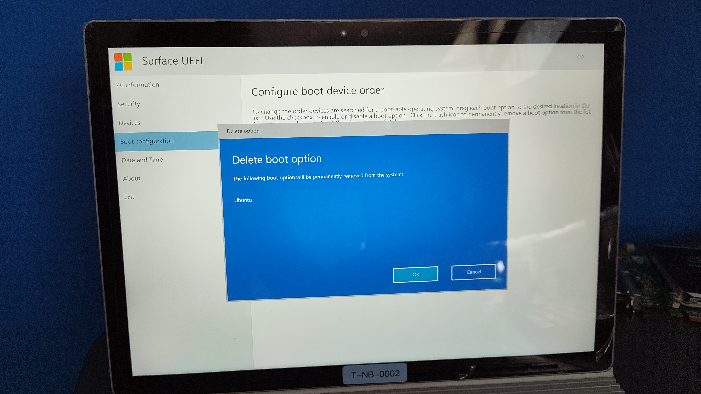
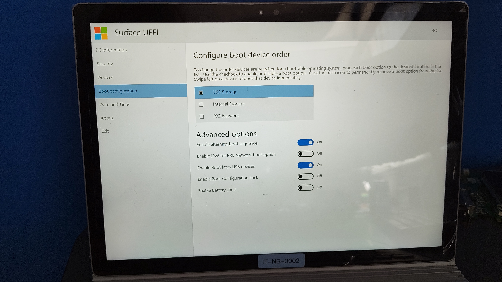
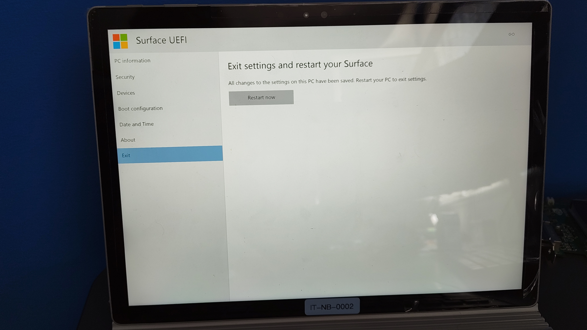

# Surface Book Touchscreen unter Linux Mint aktivieren

**Funkenflug Innovation Laboratories**

---

## 📌 Ziel

Diese Anleitung unterstützt Sie bei der Aktivierung des Touchscreens auf dem **Microsoft Surface Book Gen 1** unter **Linux Mint**. Das Projekt nutzt den **linux-surface-Kernel**, `iptsd` und `libwacom-surface`, um die volle Funktionalität des Touchscreens zu ermöglichen.

---

## 📸 Visuelle Übersicht

### BIOS-Einstellungen


  Schritt | Bild |
 |---------|------|
 | **1. USB-Stick anschließen** |  |
 | **2. BIOS starten** |  |
 | **3. Secure Boot deaktivieren** |  |
 | **4. Geräte aktivieren** |  |
 | **5. Boot-Konfiguration** |  |
 | **6. USB als Boot-Option aktivieren** |  |
 | **7. Exit and Save** |  |

## Wichtiger Hinweis zu Schritt 2: BIOS starten
Einschalten: Drücken Sie kurz den Power-Knopf, um das Surface Book einzuschalten.

BIOS betreten: Sofort nach dem Einschalten den Power-Knopf loslassen und dann Power + Lauter-Taste (Vol+) gedrückt halten, um ins BIOS zu gelangen.


 

---

## 📥 Voraussetzungen


| Komponente         | Details                                      |
| ------------------ | -------------------------------------------- |
| **Hardware**       | Microsoft Surface Book Gen 1                 |
| **Betriebssystem** | Linux Mint 22.3 (oder neuer)                 |
| **Tools**          | Rufus (Portable) oder balenaEtcher           |
| **USB-Stick**      | Mindestens 8 GB, alle Daten werden gelöscht! |


---

## 🔧 Schritt-für-Schritt-Anleitung

### 1️⃣ Linux Mint ISO herunterladen

1. Laden Sie die aktuelle Version von **Linux Mint** herunter: [Linux Mint Downloads](https://linuxmint.com/download.php).
2. Wählen Sie die **Cinnamon Edition** aus.

### 2️⃣ Bootfähigen USB-Stick erstellen

1. Laden Sie **Rufus Portable** herunter: [Rufus Downloads](https://rufus.ie/de/#download).
2. Wählen Sie die heruntergeladene ISO-Datei und Ihren USB-Stick in Rufus aus.
3. Stellen Sie sicher, dass Sie **ISO-Modus** auswählen, und starten Sie den Schreibvorgang.
4. Bestätigen Sie die Warnungen mit **Ja**.

### 3️⃣ BIOS-Einstellungen anpassen

1. Starten Sie das Surface Book und drücken Sie sofort **Power + Lauter-Taste**, um ins BIOS zu gelangen.
2. Deaktivieren Sie **Secure Boot** und **TPM**.
3. Aktivieren Sie **SMT** und stellen Sie sicher, dass alle Geräte unter **Devices** aktiviert sind.
4. Aktivieren Sie **Boot von USB** und speichern Sie die Einstellungen.

### 4️⃣ Linux Mint installieren

1. Starten Sie das Surface Book vom USB-Stick.
2. Folgen Sie den Installationsanweisungen von Linux Mint.
3. Nach der Installation aktualisieren Sie das System:
  ```bash
   sudo apt update && sudo apt upgrade -y
  ```

### 5️⃣ Touchscreen aktivieren

1. Laden Sie das Skript **Auto_Install_Touchscreen.sh** herunter und speichern Sie es in Ihrem Download-Ordner.
2. Öffnen Sie ein Terminal und navigieren Sie zum Download-Ordner:
  ```bash
   cd /home/YourUser/Downloads
  ```
3. Führen Sie das Skript aus:
  ```bash
   sudo bash Auto_Install_Touchscreen.sh
  ```
4. Starten Sie das System neu. Der Touchscreen sollte nun funktionieren.

---

## ⚠️ Häufige Probleme & Lösungen


| Problem                            | Lösung                                                                   |
| ---------------------------------- | ------------------------------------------------------------------------ |
| **Secure Boot aktiv**              | Deaktivieren Sie Secure Boot im BIOS.                                    |
| **USB wird nicht erkannt**         | Prüfen Sie den USB-Anschluss oder versuchen Sie einen anderen USB-Stick. |
| **Touchscreen funktioniert nicht** | Führen Sie `dmesg                                                        |


---

## 📜 Lizenz

Dieses Projekt steht unter der **MIT License**. Weitere Informationen finden Sie in der [LICENSE](LICENSE)-Datei.

---

## 🤝 Mitwirken

Sie haben Fragen oder Verbesserungsvorschläge? Öffnen Sie ein **Issue** auf GitHub:  
🔗 [GitHub-Repository](https://github.com/Funkenflug-Innovation-Laboratories/surface-book-touchscreen-linux-mint)

---

**🎉 Herzlichen Glückwunsch!** Ihr Surface Book läuft jetzt mit Linux Mint und aktiviertem Touchscreen.
